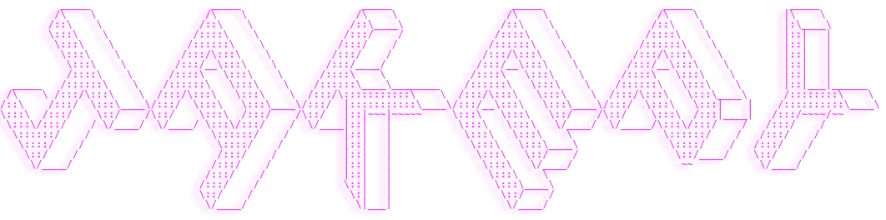

[](https://git.io/typing-svg)


  <br>



```  
  
                   .88888888:.
                88888888.88888.
              .8888888888888888.
              888888888888888888              "...programa no porque esperes a que te paguen
              88' _`88'_  `88888                  o que el publico te adore, si no porque
              88 88 88 88  88888                  programar te divierte." Linus Torvalds
              88_88_::_88_:88888
              88:::,::,:::::8888
              88`:::::::::'`8888
             .88  `::::'    8:88.
            8888            `8:888.
          .8888'             `888888.
         .8888:..  .::.  ...:'8888888:.
        .8888.'     :'     `'::`88:88888
       .8888        '         `.888:8888.
      888:8         .           888:88888
    .888:88        .:           888:88888:
    8888888.       ::           88:888888
    `.::.888.      ::          .88888888
   .::::::.888.    ::         :::`8888'.:.
  ::::::::::.888   '         .::::::::::::
  ::::::::::::.8    '      .:8::::::::::::.
 .::::::::::::::.        .:888:::::::::::::
 :::::::::::::::88:.__..:88888:::::::::::'
  `'.:::::::::::88888888888.88:::::::::'
        `':::_:' -- '' -'-' `':_::::'`
```
 

<ul>
   <li>🌱 I’m currently learning  Python, Bash, JavaScript, HTML, CSS</li>
   <li>📫 How to reach me <strong>j4kyjak3@protonmail.com</strong></li>
   <li>⚡ Fun fact <strong>astronomy fascinates me 🌌🔭</strong>
   <a href="https://moon-svg.minung.dev">
    
  </a>
  </li>
</ul>

<br/>
<h2 align='left'> Aprendiendo </h2>

<p align="center">
  <a href="https://skillicons.dev">
    
  </a>
</p>

<br/>
<h2>Editores favoritos </h2>
<p align="center">
  <a href="https://skillicons.dev">
    
</p>

<br />

<h2> Estadisticas </h2>
<a href="https://github.com/anuraghazra/github-readme-stats">
<br />
 
<!--<p>&nbsp;</p>-->
  
[](https://github.com/esteban180sx/github-readme-stats)
  
 <br />
  
[](https://github.com/esteban180sx)

  
 
